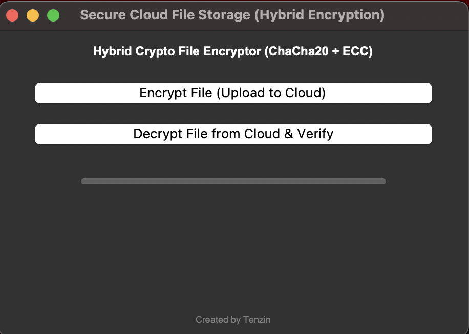

# Secure Cloud File Storage (Hybrid Encryption + Blockchain Logging)

This project is a simple and secure desktop application for encrypting and decrypting files using ChaCha20-Poly1305 encryption and HKDF-derived keys. It also simulates cloud storage and keeps a blockchain-style ledger (`blockchain.json`) to verify file integrity after decryption.

---

## How It Works

This tool helps users:

- Encrypt any file securely
- Simulate uploading the encrypted file to the cloud
- Decrypt it later with integrity verification

It uses:

- ChaCha20-Poly1305: A modern, fast, authenticated encryption algorithm
- HKDF with SHA-256: To derive a strong symmetric key from a shared secret
- Blockchain-style logging: Every encrypted file's SHA-256 hash is stored in `blockchain.json` to later verify that decryption was successful and unmodified

---

## Simulated Cloud Storage

This project does not use real cloud services.

All "cloud uploads" are simulated by saving encrypted files into a local directory named:


You can think of it as a mock cloud. Files placed there are available for decryption and verification.

---

## Features

- Select and encrypt any file via GUI
- Encrypts with ChaCha20-Poly1305 using HKDF-derived key
- Saves encrypted file in a simulated cloud directory
- Appends a hash entry to `blockchain.json` for each upload
- Allows you to decrypt encrypted files and verify them using blockchain log
- Simple, clean GUI built with Tkinter

---

## Screenshot




---

## Installation

1. Clone the repository:
   ```bash
   git clone https://github.com/yourusername/secure-cloud-storage.git
   cd secure-cloud-storage
2.Install dependencies:

pip install cryptography

3.Run the app:

python SCS.py


